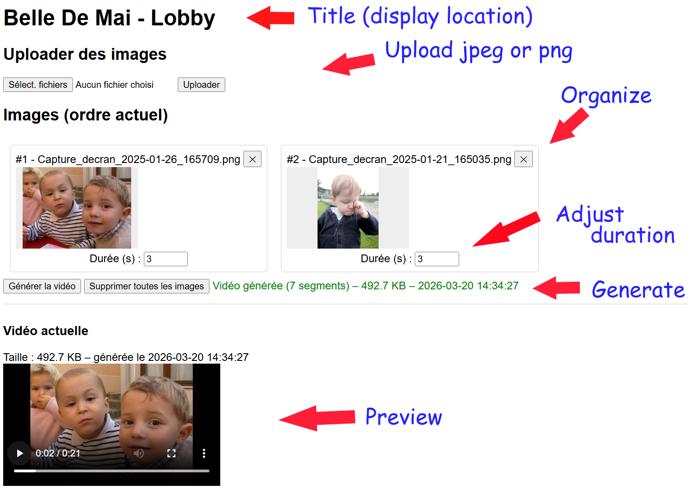

# Overview of the GUI for this very early version

Proceed as following :
- Open webpage on the raspberry   http://ip:5000
- Select then upload pictures jpeg or png (intend to be used we PC screenshot)
- Convert picture when uploading to 1280x720 jpeg to be manageable by tiny rasberry pi
- Allow user to reorganize order by swaping pictures
- Change duration
- Generate video
- Preview video is success (if failed, it keep latest video in place)

Time estimated to generate video is 8 to 10 second by picture with 3 second duration,  
*   3 photo 30s  
*   6 photo 60s  
*  10 photo 1m45s  
*  25 photo 2m50s
* 100 photo 13m10s
* 400 photo 46m30s  
---

This web page has been tested on several WIndows 11 browser (brave, chrome, Edge), on Android phone and Iphone (safari). On phones, It filter screenshots either jpeg or png not directly HEIC of webm picture.

---

   
